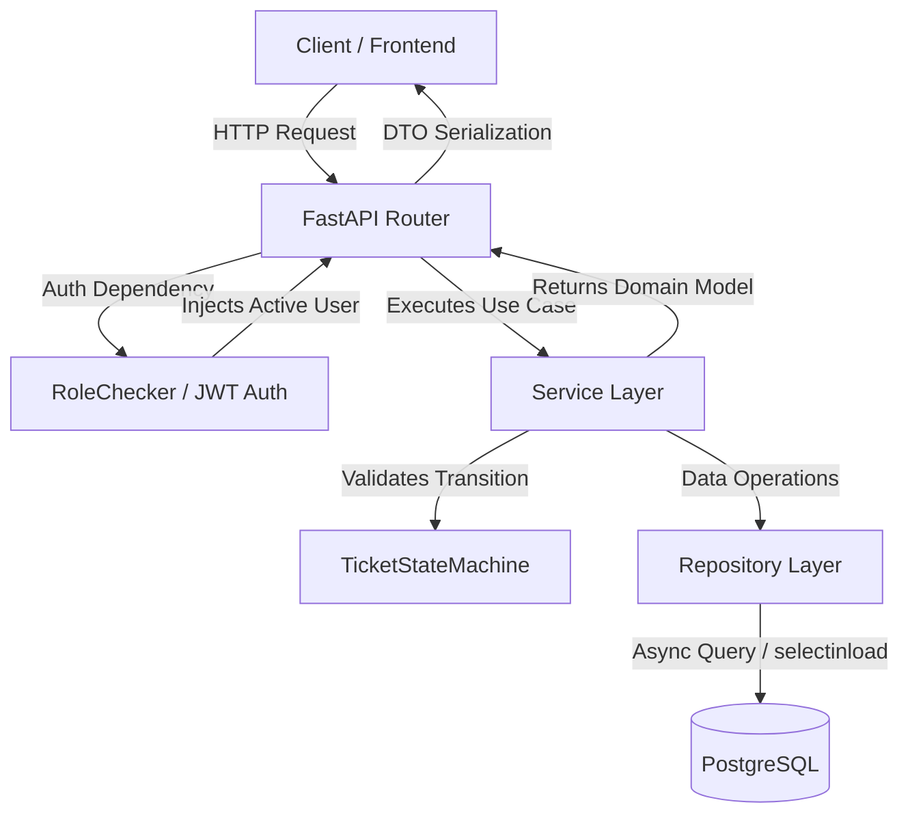
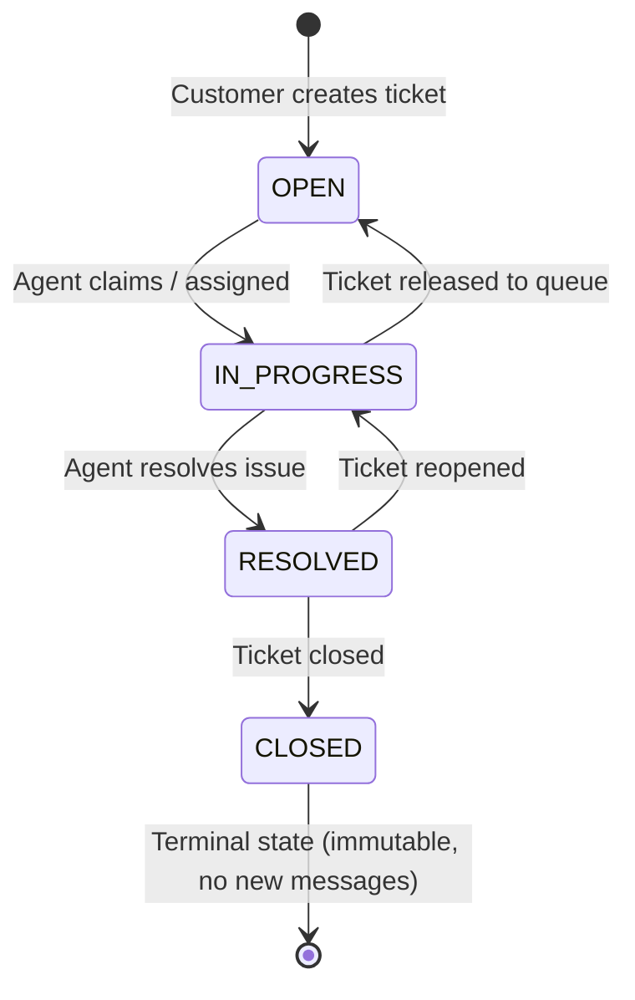

# Help Desk SaaS — Backend API

<p align="center">
  
  
  
  
  
  
  
</p>

---

## 📌 Overview

**Help Desk SaaS** is a modern, asynchronous, production-ready RESTful backend API designed for customer support and ticket management. The system features fine-grained Role-Based Access Control (**RBAC**), secure authentication with **JWT** access and refresh tokens, a strict domain-driven ticket lifecycle state machine, multi-tenant customer isolation, and fully asynchronous database operations using **SQLAlchemy 2.0** and **PostgreSQL**.

Built with **Clean Architecture**, **Domain-Driven Design (DDD)** principles, **Zero-Leakage Error Handling**, and **Test-Driven Design**, the project includes **130 automated tests** with **>98% code coverage** enforced via CI.

---

## 🏗️ Architecture & Project Structure

The codebase is organized in a modular, layered structure to ensure low coupling, separation of concerns, and high testability:

```text
app/
├── api/
│   └── v1/
│       ├── dependencies.py      # Dependency injection & RBAC enforcement (RoleChecker)
│       └── endpoints/           # HTTP REST controllers (auth, users, tickets, messages, categories)
├── core/
│   ├── config.py                # Centralized configuration with Pydantic Settings
│   └── security.py              # Password hashing (Argon2id/Bcrypt) & JWT encode/decode
├── db/
│   ├── base.py                  # DeclarativeBase for SQLAlchemy models
│   └── session.py               # Async engine and sessionmaker (asyncpg)
├── models/                      # ORM database entities (User, Ticket, Message, Category, Enums)
├── repositories/                # Data access layer & optimized queries
├── schemas/                     # Pydantic V2 DTOs and request/response contracts
├── services/                    # Business rules, use cases & State Machine
└── main.py                      # FastAPI app, CORS, middlewares & global Exception Handlers
```

### 🔄 Request Flow



---

## 🛡️ Security & Role-Based Access Control (RBAC)

The system defines 3 distinct user roles with permissions enforced at both the API layer (via dependencies) and domain services:

| Resource / Action | Customer | Agent | Admin |
| :--- | :---: | :---: | :---: |
| **Create Tickets** | ✅ Own only | ✅ Yes | ✅ Yes |
| **View Tickets** | 🔒 Own only | 🌐 All | 🌐 All |
| **Assign Ticket** | ❌ No | 👤 Self only | 👥 Any agent or self |
| **Change Status / Priority** | ❌ No | ✅ Yes | ✅ Yes |
| **Send Messages** | 🔒 Own open tickets | ✅ Any open ticket | ✅ Any open ticket |
| **Manage Categories** | 👁️ View only | 👁️ View only | 🛠️ Create / Update |
| **Manage Users** | 🔒 Own profile | 🔒 Own profile | 👑 Full access |

---

## ⚙️ Ticket Lifecycle State Machine

Ticket status transitions are strictly governed by a domain-level `TicketStateMachine`, preventing invalid jumps or illegal status modifications:



- **OPEN $\rightarrow$ IN_PROGRESS**: Triggers automatically when an agent is assigned to the ticket.
- **IN_PROGRESS $\rightarrow$ RESOLVED**: Automatically records the resolution timestamp (`resolved_at`).
- **RESOLVED $\rightarrow$ IN_PROGRESS**: Reopening a ticket automatically clears `resolved_at`.
- **RESOLVED $\rightarrow$ CLOSED**: Sets `closed_at`. Closed tickets are terminal and permanently reject new messages.

---

## 💡 Technical Decisions & Engineering Trade-offs

Key architectural and technical choices made throughout the project:

1. **SQLAlchemy 2.0 Async + `selectinload`**:
   - *Decision*: Using the asynchronous driver `asyncpg` combined with SQLAlchemy 2.0 declarative typing (`Mapped[...]` and `mapped_column`). Nested relationships (`customer`, `agent`, `category`) use the `selectinload` eager-loading strategy.
   - *Rationale*: Completely prevents N+1 query bottlenecks on relation lookups and eliminates `MissingGreenlet` exceptions common in async Python ORMs.

2. **Password Hashing with Argon2id (`pwdlib`)**:
   - *Decision*: Utilizing Argon2id as the default password hashing algorithm, with backward-compatible support and fallback to Bcrypt.
   - *Rationale*: Argon2id is the winner of the Password Hashing Competition and the official OWASP recommendation against GPU/ASIC-based brute-force attacks.

3. **JWT Authentication with Short-Lived Access & Typed Refresh Tokens**:
   - *Decision*: Access tokens expire quickly (30 min) and embed user authorization claims (`role`). Refresh tokens have a longer lifespan (7 days) and are strictly validated against token type `refresh`.
   - *Rationale*: Minimizes security exposure if an access token is intercepted, allowing seamless session extension without requiring re-authentication.

4. **Zero-Leakage Global Error Handling**:
   - *Decision*: Custom exception handlers intercept `HTTPException`, Pydantic's `RequestValidationError` (422), and generic unhandled `Exception` (500).
   - *Rationale*: Prevents internal database traces, queries, or server-side exception details from leaking to clients, while capturing full structured error logs internally.

5. **Tooling with `uv` & Docker Layer Caching**:
   - *Decision*: Modern package management via Astral's `uv` and multi-stage Docker builds caching the virtual environment before copying source code.
   - *Rationale*: Drastically speeds up local installation and container build times (sub-2-second rebuilds) while guaranteeing deterministic environments via `uv.lock`.

---

## 🚀 Getting Started

### Prerequisites
- [Docker](https://www.docker.com/) and [Docker Compose](https://docs.docker.com/compose/) **OR**
- Python 3.12+ and [uv](https://docs.astral.sh/uv/).

---

### Option 1: Running with Docker Compose (Recommended)

Start the entire stack (FastAPI application + PostgreSQL with automatic migrations) with a single command:

```bash
docker compose up --build
```

The API is immediately accessible at:
- **Interactive Swagger UI**: [http://localhost:8000/docs](http://localhost:8000/docs)
- **ReDoc Documentation**: [http://localhost:8000/redoc](http://localhost:8000/redoc)
- **Health Check Endpoint**: [http://localhost:8000/health](http://localhost:8000/health)

---

### Option 2: Running Locally with `uv`

1. **Clone the repository:**
   ```bash
   git clone https://github.com/JulioFigueiredo/help-desk-api.git
   cd help-desk-api
   ```

2. **Create virtual environment and install all dependencies:**
   ```bash
   uv sync --all-groups
   ```

3. **Configure environment variables:**
   ```bash
   cp .env.example .env
   ```

4. **Start the PostgreSQL database via Docker:**
   ```bash
   docker compose up -d postgres
   ```

5. **Apply database migrations (Alembic):**
   ```bash
   uv run alembic upgrade head
   ```

6. **Start the development server:**
   ```bash
   uv run uvicorn app.main:app --reload --port 8000
   ```

---

## 🧪 Automated Testing & Code Quality

The test suite covers unit logic, integration flows, RBAC authorization, state machine transitions, and error edge cases.

```bash
# Run test suite with coverage report
uv run pytest

# Run with line-by-line missing coverage report
uv run pytest --cov=app --cov-report=term-missing

# Run code linter (Ruff)
uv run ruff check .

# Run code formatter (Ruff)
uv run ruff format .
```

### 📈 Quality Metrics:
- **Test Suite**: 130 automated tests passing.
- **Code Coverage**: **`98.7%`** (enforced at minimum 90% threshold in CI via `--cov-fail-under=90`).
- **Linter & Formatter**: 100% clean across all 60+ repository files.

---

## 📡 API Reference Overview

| Method | Endpoint | Tag | Description | Access |
| :--- | :--- | :--- | :--- | :--- |
| `POST` | `/api/v1/auth/register` | `Auth` | Register a new customer user account | 🔓 Public |
| `POST` | `/api/v1/auth/login` | `Auth` | Authenticate and obtain JWT access/refresh tokens | 🔓 Public |
| `POST` | `/api/v1/auth/refresh` | `Auth` | Renew access token using refresh token | 🔓 Public |
| `GET` | `/api/v1/users/me` | `Users` | Retrieve current authenticated user profile | 🔒 Authenticated |
| `GET` | `/api/v1/users/` | `Users` | List all users (paginated) | 👑 Admin |
| `POST` | `/api/v1/users/` | `Users` | Create user/agent account | 👑 Admin |
| `GET` | `/api/v1/users/{id}` | `Users` | Get user profile details | 🔒 Own / Admin |
| `PATCH`| `/api/v1/users/{id}` | `Users` | Update user profile data | 🔒 Own / Admin |
| `POST` | `/api/v1/tickets/` | `Tickets` | Open a new support ticket | 🔒 Authenticated |
| `GET` | `/api/v1/tickets/` | `Tickets` | List tickets with dynamic filters, sorting & pagination | 🔒 Authenticated (Tenant isolated) |
| `GET` | `/api/v1/tickets/{id}` | `Tickets` | Retrieve complete ticket details | 🔒 Own / Staff |
| `POST` | `/api/v1/tickets/{id}/assign` | `Tickets` | Assign ticket to an agent or claim ticket | 🛡️ Staff (Agent/Admin) |
| `PATCH`| `/api/v1/tickets/{id}/status` | `Tickets` | Update ticket status (validates state machine) | 🛡️ Staff (Agent/Admin) |
| `PATCH`| `/api/v1/tickets/{id}/priority` | `Tickets`| Update ticket priority level | 🛡️ Staff (Agent/Admin) |
| `GET` | `/api/v1/tickets/{id}/messages`| `Messages`| Retrieve message history for a ticket | 🔒 Own / Staff |
| `POST` | `/api/v1/tickets/{id}/messages`| `Messages`| Post a new message on an active ticket | 🔒 Own / Staff |
| `GET` | `/api/v1/categories/` | `Categories` | List all active ticket categories | 🔒 Authenticated |
| `POST` | `/api/v1/categories/` | `Categories` | Create a new ticket category | 👑 Admin |
| `GET` | `/api/v1/categories/{id}` | `Categories` | Retrieve category details by ID | 🔒 Authenticated |
| `GET` | `/health` | `Health` | Application health check status | 🔓 Public |

---

## 🗺️ Project Roadmap

- [x] **Milestone 1 — Setup**: FastAPI, uv, Ruff, PostgreSQL, SQLAlchemy 2.0 Async, Alembic, Docker, Pytest.
- [x] **Milestone 2 — Authentication**: User Model, Register, Login, Argon2/Bcrypt, Access/Refresh JWT, RBAC.
- [x] **Milestone 3 — Tickets**: Ticket & Category Models, CRUD, Dynamic Filters, Pagination, Secure Sorting.
- [x] **Milestone 4 — Support Workflow**: Agent Assignment, Domain State Machine, Ticket Messages, Tenant Isolation.
- [x] **Milestone 5 — Quality & Portfolio**: Global Exception Handlers, GitHub Actions CI, Dockerfile, >98% Test Coverage, 90% Coverage Enforcement, Comprehensive Documentation.
- [ ] **Milestone 6 — Asynchronous Processing**: Background job queue with Redis + Worker (email notifications & event dispatch).
- [ ] **Milestone 7 — Real-Time Communication**: WebSockets for live ticket updates and real-time conversation threads.
- [ ] **Milestone 8 — Production & Observability**: Prometheus metrics, OpenTelemetry tracing, and cloud deployment.

---
